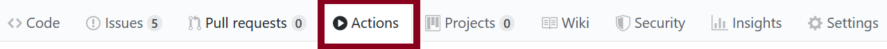

# Project Template

This repository is your starting point for your project. Please look through all these materials so you know how to organize your project.

Link to your GitHub pages website: [https://ds4200-fall21-sec02.github.io/project-happiness-gc-as-di-ea-mz/]

# Aim of the assignment

The purpose of this assignment is to get you and your group memebers set up with a project repo that includes the template you will use for your final project webpage.

# Instructions

Please look through **all** the materials below before starting. This will ensure you understand the setup instructions; how to run, organize, and submit your code; and requirements for this assignment.

## Setup

You should do all your edits locally after cloning this repository. Commit major versions to your git repository.

1. Clone this repository to your local machine.
   - In your terminal / command prompt `CD` to where you want this the folder for this activity to be. Then run `git clone <YOUR_REPO_URL>`

1. In order to read data from csv files, you will need to use a python simple server. To do that follow these steps:
   - `CD` or open a terminal / command prompt window into the folder you cloned above.
   - Start a python simple server from that folder with one of these commands (depending on how you set python up on your machine): `python -m http.server`, `python3 -m http.server`, or `py -m http.server`. 
   - If you are using python 2 you will need to use `python -m SimpleHTTPServer` instead, but please switch to python 3 as [Python 2 was sunset on 2020-01-01](https://www.python.org/doc/sunset-python-2/).
   - After running the command, wait for the output: `Serving HTTP on 0.0.0.0 port 8000 (http://0.0.0.0:8000/)`.
   - Open your web browser (Firefox or Chrome) and navigate to the URL: http://localhost:8000. This is where you will see your code rendered. 

## Update hyperlinks

1. Edit near the top of this `README.md` file to include a clickable hyperlink to the GitHub pages website for your repo., replacing the `` `[insert your *clickable* hyperlink here]` `` code with your markdown. (Detailed instructions for GitHub pages [here](https://developer.mozilla.org/en-US/docs/Learn/Common_questions/Using_Github_pages).)

1. In `index.html` update the GitHub repo URL with the URL of your repository. It is in the span with `id='forkongithub'`.

## Add hyperlink to your paper draft

1. Edit near the top of this `README.md` file to include a clickable hyperlink to the GitHub pages website for your repo. Replace `` `[insert your *clickable* hyperlink here]` `` with your clickable URL. 

1. Add a clickable hyperlink to your GitHub Classroom-generated repository to the end of the Abstract in your paper draft.

## Organization

Here is an overview of the files and folders provided in your repo.

### Root Files

* `README.md` is this explanatory file.

* `index.html` contains the main website content. It includes comments surrounded by `<!--` and `-->` to help guide you through making your edits.

* `style.css` contains the CSS.

* `LICENCE` is the source code license for the template. You can add your name or leave it as is.

### Folders

Each folder has an explanatory `README.md` file.

* `data` will hold the data file(s) for your visualizations.

* `favicons` contains the favicons for the web page. You shouldn't change anything here.

* `img` will contain your screenshots, diagrams, and photos.

* `.github` contains [GitHub Actions](https://github.com/features/actions) ([docs](https://docs.github.com/en/actions)) which will automatically validate your HTML, CSS, and hyperlinks when you push (see the [**Validated** requirement below](#validated)). **You should not edit files here** except to create new `.yml` files for any additional actions you choose to add (you are not required to make any).

* `files` will contain your slides (PDF), final paper (PDF), and video (MP4).

* `js` will contain all JavaScript files you write.   

* `lib` will contain any JavaScript library you use. It currently includes D3. To ensure long-term survivability, *use the included D3 here rather than linking to [d3js.org](https://d3js.org) or some other CDN.* Likewise, put your other libraries here rather than loading them from elsewhere.

## Software license

1. Review the license for your project in `LICENSE`. The default license we include in the template `LICENCE` file is the open source [3-Clause BSD License](https://opensource.org/licenses/BSD-3-Clause). You are not required to make your project open source but it is preferred and enables easier adoption of your contributions by others. 
   
1. Add your names to `LICENCE`.
If you make any changes to your license other than including your names that are not approved by the teaching staff, you will need to sign a [Non-exclusive Right to Use and Modify Agreement](https://www.ccs.neu.edu/home/cody/courses/shared/S-L_project_partner_usage_agreement.pdf) so your project partner can actually use what you’ve made.

## Implement your visualizations

This and following project milestone (pm) assignments will ask you to implement visualizations for your final project. Please refer to assignment instructions on Canvas for detailed outlines of what is expected for each project milestone. In addition, for all your development follow these guidelines:

1.  Ensure your code passes the 'Validate HTML, CSS, and Links' checks we run when you push to GitHub. I.e., you want to see a green check next to your commit
  (<svg width='16' height='16' role='img'><path stroke='#22863a' d='M13.78 4.22a.75.75 0 010 1.06l-7.25 7.25a.75.75 0 01-1.06 0L2.22 9.28a.75.75 0 011.06-1.06L6 10.94l6.72-6.72a.75.75 0 011.06 0z'></path></svg>)
  and not a red X
  (<svg width='16' height='16' role='img'><path stroke='#cb2431' d='M3.72 3.72a.75.75 0 011.06 0L8 6.94l3.22-3.22a.75.75 0 111.06 1.06L9.06 8l3.22 3.22a.75.75 0 11-1.06 1.06L8 9.06l-3.22 3.22a.75.75 0 01-1.06-1.06L6.94 8 3.72 4.78a.75.75 0 010-1.06z'></path></svg>).
You can also see the results in the Actions tab of your repo:

1. Note that you do not need to commit to test your code. E.g., you don’t need to deploy your GitHub page to see your changes as you make them. Instead, serve the web page out of your repo folder using your terminal and a Python simple server.

1. Don't commit private/confidential data.

## Workflow

Instead of all working directly out of the main `gh-pages` branch of your repository, we recommend you try a `branching` model for development. With this model, you will create and checkout `branches` of your repository to work on different features of your final project. After a feature is complete, you will committ changes to the branch you were working on, and then create a pull request to merge your changes back into the main branch of the repository. This will help you avoid accidentally overwriting eachother's code, and will keep your work on different aspects of the project more organized. 

You can [learn more about branching here](https://medium.com/@patrickporto/4-branching-workflows-for-git-30d0aaee7bf).   

As you work with your team, you may have issues merging your changes (conflicts are normal! You just need to manage them). We recommend you pick one member of the team to be the project manager and deal with merging any pull requests.

# Academic integrity

You are welcome to use D3 tutorials or resources as a starting point for your code.
However, **you must cite and reference the resources or sample code you use and explain how you use them**.
***This includes anything from [bl.ocks.org](https://bl.ocks.org/), [Observable](https://observablehq.com/@d3/gallery), or [Stack Overflow](https://stackoverflow.com/)!***
Failure to properly cite and attribute code is a breach of academic integrity.

Additionally, you should under no circumstances copy another group's code. You are welcome to ask fellow classmates and students for help and discuss the assignment, but **your group's submission should be your own work**.
See Canvas for more detail on our academic integrity policy and expectations.

# Submission

1. Ensure you updated (1) the GitHub Pages URL at the top of this `README.md` file, (2) the GitHub repository URL in `index.html` in the span with `id='forkongithub'`, and (3) added a clickable hyperlink to your GitHub Classroom-generated repository to the end of the Abstract in your paper draft. 

1. Commit all your local files and push them to the remote repository on GitHub which was generated by GitHub Classroom. We will grade based on what is visible on the GitHub Page.

1. Make sure your data is included in the repository on GitHub in the `data` folder.

1. Check on Canvas for the specific requirements of the project milestone you are completing including further submission instructions. 
